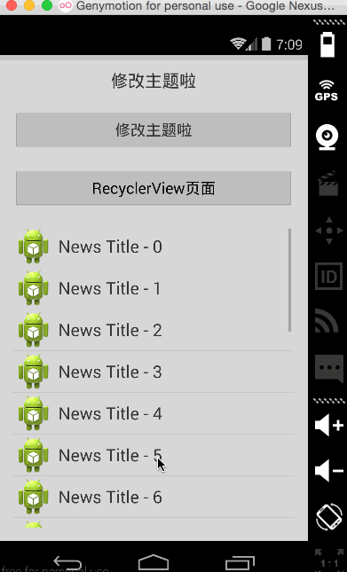

[](http://www.android-gems.com/lib/bboyfeiyu/Colorful)

# Colorful 动态换肤开源库

基于Theme的Android动态换肤开源库,以简单的方式实现夜间模式。

效果如下：




`Demo工程依赖support v7，请自行添加依赖` 

## 一、使用方式

### 1.1 自定义属性

```xml
<?xml version="1.0" encoding="utf-8"?>
<resources>

    <!-- 自定义属性 -->
    <attr name="root_view_bg" format="reference|color" />
    <attr name="btn_bg" format="reference|color" />
    <attr name="text_color" format="reference|color" />

</resources>
```

### 1.2 在布局中使用自定义属性设置View的背景、文本颜色等属性

activity_main.xml中的布局: 


```xml
<RelativeLayout xmlns:android="http://schemas.android.com/apk/res/android"
    xmlns:tools="http://schemas.android.com/tools"
    android:id="@+id/root_view"
    android:layout_width="match_parent"
    android:layout_height="match_parent"
    android:background="?attr/root_view_bg"
    tools:context="com.example.androidthemedemo.MainActivity" >

    <TextView
        android:id="@+id/textview"
        android:layout_width="match_parent"
        android:layout_height="wrap_content"
        android:gravity="center"
        android:text="@string/change_theme"
        android:textColor="?attr/text_color"
        android:textSize="20sp" />

    <Button
        android:id="@+id/change_btn"
        android:layout_width="match_parent"
        android:layout_height="wrap_content"
        android:layout_below="@id/textview"
        android:layout_marginTop="20dp"
        android:text="@string/change_theme"
        android:textColor="?attr/text_color" />

    <Button
        android:id="@+id/second_btn"
        android:layout_width="match_parent"
        android:layout_height="wrap_content"
        android:layout_below="@id/change_btn"
        android:layout_marginTop="20dp"
        android:text="@string/sec_act"
         />

    <ListView
        android:id="@+id/listview"
        android:layout_width="match_parent"
        android:layout_height="match_parent"
        android:layout_below="@id/second_btn"
        android:layout_marginTop="20dp" />

</RelativeLayout>

```

例如上述布局中我们将root_view的背景设置为`"?attr/root_view_bg"`，代表它的背景是自定义属性root_view_bg的值，还有Textview和Button的textColor属性设置为`"?attr/text_color"`。

### 1.3 定义多个Theme

然后在不同的Theme中为这些属性设置不同的值,例如，通常我们有日间和夜间模式两种颜色模式。styles.xml中的完整代码如下: 

```xml
<resources>

    <style name="AppBaseTheme" parent="Theme.AppCompat.Light">
    </style>

    <!-- Application theme. -->
    <style name="AppTheme" parent="AppBaseTheme">
    </style>

    <!-- 日间主题 -->
    <style name="DayTheme" parent="AppTheme">
        <item name="root_view_bg">@drawable/bg_day</item>
        <item name="btn_bg">@color/white_btn_color</item>
        <item name="text_color">@color/black_tx_color</item>
    </style>

    <!-- 夜间主题 -->
    <style name="NightTheme" parent="AppTheme">
        <item name="root_view_bg">@drawable/bg_night</item>
        <item name="btn_bg">@color/black_btn_color</item>
        <item name="text_color">@color/white_tx_color</item>
    </style>

</resources>

```

两个主题下为同一个属性设置了不同的值，达到切换主题时修改View的相关属性的目的。例如定义在colors.xml中的颜色值。

```xml
<?xml version="1.0" encoding="utf-8"?>
<resources>

    <!-- 日间模式 -->
    <color name="white_btn_color">#3BB32E</color>
    <color name="black_tx_color">#333333</color>

    <!-- 夜间模式 -->
    <color name="black_btn_color">#aa7788</color>
    <color name="white_tx_color">#f0f0f0</color>

</resources>
```

### 1.4 设置要修改的View的属性

下面我们为activity_main.xml中的视图进行换肤设置: 


```java
ListView  mNewsListView = (ListView) findViewById(R.id.listview);

// 为ListView设置要修改的属性,在这里没有对ListView本身的属性做修改
ViewGroupSetter listViewSetter = new ViewGroupSetter(mNewsListView, 0);
// 绑定ListView的Item View中的news_title视图，在换肤时修改它的text_color属性
listViewSetter.childViewTextColor(R.id.news_title, R.attr.text_color);


// 构建Colorful对象
Colorful mColorful = new Colorful.Builder(this)
		.backgroundDrawable(R.id.root_view, R.attr.root_view_bg) // 设置view的背景图片
		.backgroundColor(R.id.change_btn, R.attr.btn_bg) // 设置按钮的背景色
		.textColor(R.id.textview, R.attr.text_color) // 设置文本颜色
		.setter(listViewSetter)           // 手动设置setter
		.create(); 

```


首先我们定义了一个listViewSetter，该Setter用于为ListView的每个Item View中的news_title控件设置文本颜色，文本颜色的值是自定义属性text_color的颜色值。然后构建Colorful对象，并且id分别为change_btn、root_view、textview的控件绑定特定属性值，例如backgroundDrawable(R.id.root_view, R.attr.root_view_bg)代表root_view的背景Drawable为自定义属性root_view_bg的值，textColor(R.id.textview, R.attr.text_color)表示id为textview的TextView控件的文本颜色为R.attr.text_color的值。这些属性都在不同的Theme中有不同的值，因此切换Theme时就会发生变化。然后我们将listViewSetter添加到Colorful对象中，在修改主题时被遍历ListView中的所有Item View，然后修改news_title控件的文本颜色。

### 1.5 切换主题
最后通过Colorful对象设置主题即可实现切换，代码如下: 

```java

boolean isNight = false ;

// 切换主题
private void changeThemeWithColorful() {
	if (!isNight) {
		mColorful.setTheme(R.style.DayTheme);
	} else {
		mColorful.setTheme(R.style.NightTheme);
	}
	isNight = !isNight;
}
```